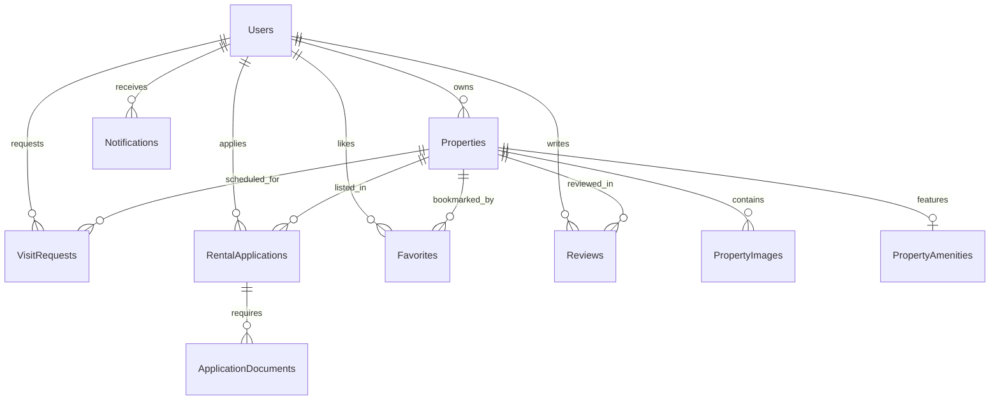

# SmartRent Database Structure

This document provides a comprehensive overview of the **SmartRent** database schema, including tables, columns, constraints, and relationships.

## 1. Entity-Relationship Diagram (Conceptual)

---

## 2. Table Definitions

### 🟢 `Users`
Stores authentication and profile information for all system users (Admins, Landlords, Tenants).

| Column | Data Type | Constraints | Description |
| :--- | :--- | :--- | :--- |
| **Id** | `int` | Primary Key, Identity | Unique identifier. |
| **FullName** | `nvarchar(100)` | Required | User's full name. |
| **Email** | `nvarchar(100)` | Required, Unique Index | Login identity. |
| **Password** | `nvarchar(255)` | Required | Hashed password. |
| **PhoneNumber**| `nvarchar(20)` | Nullable | Contact number. |
| **Role** | `nvarchar(20)` | Required | `Admin`, `Landlord`, or `Tenant`. |
| **IsApproved** | `bit` | Default: `false` | Approval status (Required for Landlords). |
| **ProfileImage**| `nvarchar(500)` | Nullable | URL to profile picture. |
| **IsActive** | `bit` | Default: `true` | Account status. |
| **CreatedAt** | `datetime2` | Required | Registration timestamp. |

### 🏠 `Properties`
Stores listings uploaded by Landlords and approved by Admins.

| Column | Data Type | Constraints | Description |
| :--- | :--- | :--- | :--- |
| **Id** | `int` | Primary Key, Identity | Unique identifier. |
| **Title** | `nvarchar(150)` | Required | Property title. |
| **Description**| `nvarchar(max)` | Nullable | Detailed description. |
| **Price** | `decimal(10,2)` | Required | Rental price. |
| **Location** | `nvarchar(200)` | Required | City/Address. |
| **PropertyType**| `nvarchar(50)` | Required | `Apartment`, `House`, `Studio`, `Villa`, etc. |
| **RentalStatus**| `nvarchar(20)`| Default: `Available`| `Available`, `Rented`, `Pending`. |
| **IsApproved** | `bit` | Default: `false` | Visibility controlled by Admin. |
| **IsActive** | `bit` | Default: `true` | Landlord visibility toggle. |
| **LandlordId** | `int` | Foreign Key | Reference to `Users.Id`. |
| **CreatedAt** | `datetime2` | Required | Creation timestamp. |
| **UpdatedAt** | `datetime2` | Nullable | Last modification timestamp. |

### 🖼️ `PropertyImages`
Links multiple photos to a single property.

| Column | Data Type | Constraints | Description |
| :--- | :--- | :--- | :--- |
| **Id** | `int` | Primary Key, Identity | Unique identifier. |
| **PropertyId** | `int` | Foreign Key | Reference to `Properties.Id`. |
| **ImageUrl** | `nvarchar(500)` | Required | URL to image file. |
| **IsMain** | `bit` | Required | If `true`, used as the thumbnail. |

### ✨ `PropertyAmenities`
One-to-One mapping for property features.

| Column | Data Type | Constraints | Description |
| :--- | :--- | :--- | :--- |
| **Id** | `int` | Primary Key, Identity | Unique identifier. |
| **PropertyId** | `int` | Foreign Key, Unique | Reference to `Properties.Id`. |
| **HasParking** | `bit` | Required | |
| **HasElevator** | `bit` | Required | |
| **IsFurnished** | `bit` | Required | |
| **HasPool** | `bit` | Required | |

### 📅 `VisitRequests`
Requests from Tenants to view a property.

| Column | Data Type | Constraints | Description |
| :--- | :--- | :--- | :--- |
| **Id** | `int` | Primary Key, Identity | Unique identifier. |
| **PropertyId** | `int` | Foreign Key | Reference to `Properties.Id`. |
| **TenantId** | `int` | Foreign Key | Reference to `Users.Id`. |
| **RequestedDate**| `datetime2` | Required | Preferred visiting date. |
| **Message** | `nvarchar(500)` | Nullable | Message from tenant. |
| **Status** | `nvarchar(20)` | Default: `Pending` | `Pending`, `Approved`, `Rejected`. |
| **LandlordNote**| `nvarchar(500)` | Nullable | Response from landlord. |

### 📄 `RentalApplications`
Formal applications to rent a property.

| Column | Data Type | Constraints | Description |
| :--- | :--- | :--- | :--- |
| **Id** | `int` | Primary Key, Identity | Unique identifier. |
| **PropertyId** | `int` | Foreign Key | Reference to `Properties.Id`. |
| **TenantId** | `int` | Foreign Key | Reference to `Users.Id`. |
| **Status** | `nvarchar(20)` | Default: `Pending` | `Pending`, `Approved`, `Rejected`. |
| **MoveInDate** | `datetime2` | Required | Starting date of lease. |
| **LeaseEndDate** | `datetime2` | Nullable | End date of lease. |
| **ProposedRent** | `decimal(10,2)` | Required | Agreed/Proposed monthly rent. |
| **CoverLetter** | `nvarchar(2000)`| Nullable | Tenant's motivation. |
| **Notes** | `nvarchar(max)` | Nullable | Additional info. |
| **RejectionReason**| `nvarchar(500)`| Nullable | Response to rejection. |

### 📎 `ApplicationDocuments`
Supporting documents for rental applications.

| Column | Data Type | Constraints | Description |
| :--- | :--- | :--- | :--- |
| **Id** | `int` | Primary Key, Identity | Unique identifier. |
| **ApplicationId**| `int` | Foreign Key | Reference to `RentalApplications.Id`. |
| **DocumentUrl** | `nvarchar(500)` | Required | URL to document file. |
| **DocumentType** | `nvarchar(100)` | Nullable | `ID`, `ProofOfIncome`, `Reference`. |

### ⭐ `Reviews`
Tenant feedback for properties and landlords.

| Column | Data Type | Constraints | Description |
| :--- | :--- | :--- | :--- |
| **Id** | `int` | Primary Key, Identity | Unique identifier. |
| **PropertyId** | `int` | Foreign Key | Reference to `Properties.Id`. |
| **TenantId** | `int` | Foreign Key | Reference to `Users.Id`. |
| **Rating** | `int` | Range: 1-5 | Numeric satisfaction score. |
| **Comment** | `nvarchar(max)` | Nullable | Qualitative feedback. |
| **CreatedAt** | `datetime2` | Required | Timestamp. |

---

## 3. System Constraints & Indexes

1.  **Unique Emails**: `Users.Email` is case-insensitive unique to prevent duplicate accounts.
2.  **Cascading Deletes**:
    *   Deleting a `Property` deletes its `PropertyImages` and `PropertyAmenities`.
    *   Deleting a `RentalApplication` deletes its `ApplicationDocuments`.
3.  **Soft Constraints**:
    *   `Properties.RentalStatus` transitions are handled through application logic.
    *   Only `Admin` role can modify `IsApproved` on `Users` (Landlords) and `Properties`.
